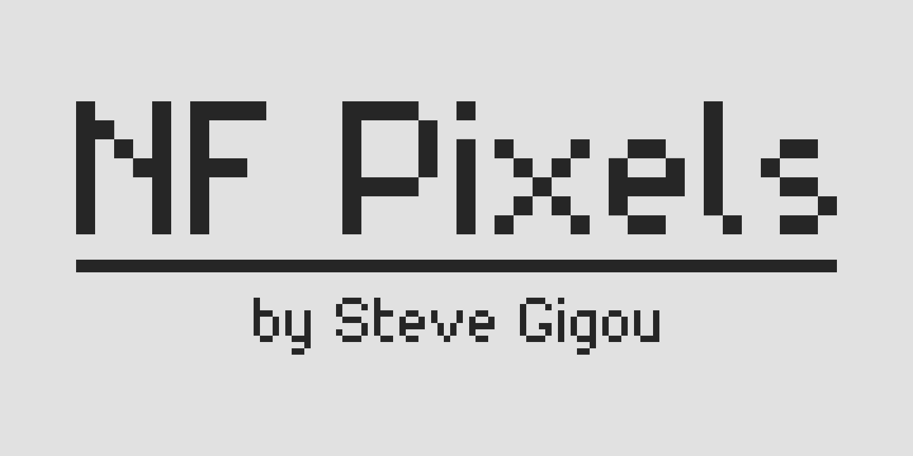

# NF-Pixels

A free pixel font focused on minimalism.

## Features

### Font design

This font was originally created to be used in a pixel-art game on iOS.

Some unique features make its strength:

* A simple design makes it very readable [even at small sizes](showcases/illustrations/readability.png).
* It covers all western european languages.
* It has a lot of symbols.

### Weights

NF Pixels only features a Regular weight at this moment.

A bold version is planned: #1

Obviously, there is no italic version planned, as it is quite hard to make it readable with a pixel font…

### Ligatures

NF Pixels features standard ligatures to improve readability.

## Installation

The easiest way to get the last version is to get files from the [releases page](https://github.com/sgigou/NF-Pixels/releases).

You will find `ttf` and `otf` files in the [fonts directory](fonts/).

You can also take a look at the [sources folder](sources) to find the work files.

If you want some examples, you can go to the [showcases directory](showcases) to see the table of characters, and some real-life examples.

## Examples

### All chars

### Pixel grid

### Readability

### Game example

## License

This font is under [SIL Open Font License 1.1](LICENSE)

## Credits

* Steve Gigou ([Github](https://github.com/sgigou), [Website](https://steve.gigou.fr), [Twitter](https://twitter.com/stevegigou))
